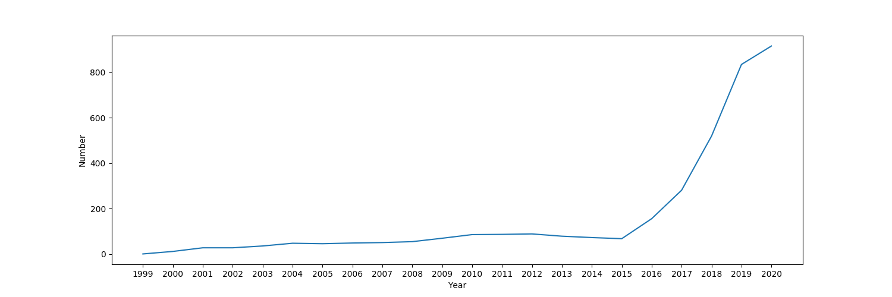
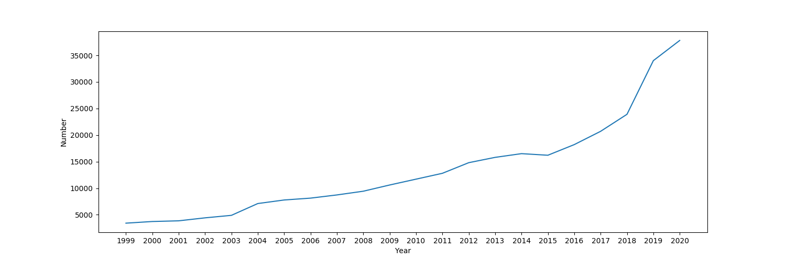
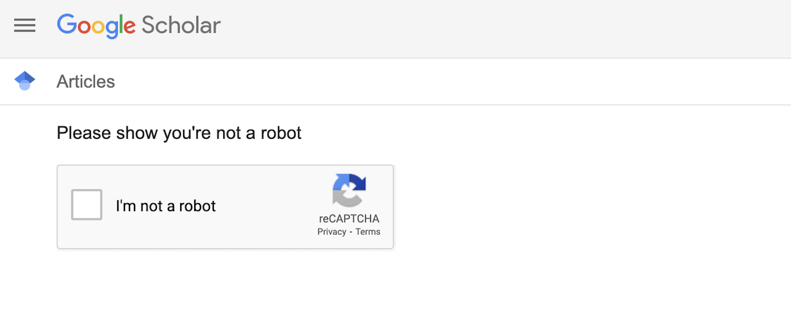

# citationOverTime

## 1. What can I get by this tool?
- Trend chart and [csv](example/14537753363344344488_1999_2020_1.csv) of the number of paper citations over time.
  
- Trend chart and [csv](saveData/images/deep+reinforcement+learning_1999_2002_1.csv) of the number of papers published with keywords over time.
  

## 2. Hot to run it?
- python runGetNumByYears.py

### 2.1 How to set my dream papers and keywords?
- In runGetNumByYears.py:
  -  Put the keyword which you want to analysis;
     -  eg. `keywords = ["deep+reinforcement+learning"]`
  -  Put the id of the paper which you want to analysis;
     - eg. `paperIDs = [14537753363344344488]`
  - Set the x_axis, and you can set more than one x_axis;
    - `startYears = [1999]`            
    - `endYears = [2020]`  
    - `yearSteps = [1]`

### 2.2 Where is the saved data?
- In saveData folder.

### 2.3How to get paper id?
1. Search paper in Google Scholar.
   - eg, `Policy gradient methods for reinforcement learning with function approximation`
2. Click `Cited by xxx` the you can get paper ID from the URL.
   - ie. `https://scholar.google.com/scholar?cites=14537753363344344488&as_sdt=2005&sciodt=0,5&hl=en`
   - `14537753363344344488` is the `paperID`

### 2.4 What should I do when meeting 'Error: Pls manually pass the robot detecting...'
   - 'Error: Pls manually pass the robot detecting by setting viewChrome to True and click 'I'm not a robot' in alert Chrome' meaning you are under google rebot detecting. Unfortunately you should manually pass it :)
  
  - Fortunately, the tool save the web cache into ./cache, so you needn't frequently test robot detecting.

### 2.5 Can I hidden the view of Chrome？
- Yes you can! Pls set `viewChrome = False` in runGetNumByYears.py. 
- By the way, if you close the view, you can't directly operate the web page when meeting the robot detecting. Then you should close the running task, open the viewChrome, pass the robot detecting, and re-run the interrupted task.

---

## requirements
- Chrome
- [chromedriver](https://chromedriver.chromium.org/downloads)
  - please check the version of your chrome when downloading
- pip install selenium webdriver_manager

---

## Todo
 - [ ] Auto-get paperId by paper name.
 - [ ] Mix the trend of papers or keywords.
 - [ ] Save dream paper name and abstracts.
